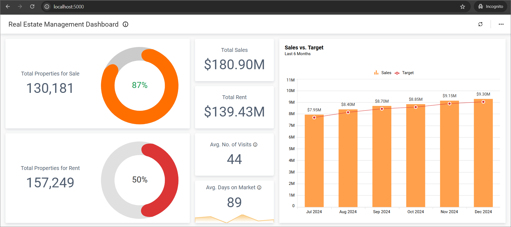

# BoldBI Embedding React with Python Sample

This project was created using React with Python. This application aims to demonstrate how to render the dashboard available on your Bold BI server.

## Dashboard view

   

## Prerequisites

The samples require the following to run.

 * [Python installer](https://www.python.org/downloads/)
 * [Visual Studio Code](https://code.visualstudio.com/download)
 * [Python extension in VS code](https://marketplace.visualstudio.com/items?itemName=ms-python.python)

### Help link

* <https://help.boldbi.com/embedded-bi/faq/where-can-i-find-the-product-version/?utm_source=github&utm_medium=backlinks>

#### Supported browsers
  
* Google Chrome, Microsoft Edge, and Mozilla Firefox.

## Configuration

* Please [get](https://github.com/boldbi/react-with-aspnet-core-sample/tree/master/React-with-ASP.NETCore) the React with ASP.NET Core sample from GitHub.

* Please ensure you have enabled embed authentication on the `embed settings` page. If it is not currently enabled, please refer to the following image or detailed [instructions](https://help.boldbi.com/site-administration/embed-settings/#get-embed-secret-code?utm_source=github&utm_medium=backlinks) to enable it.
   

* To download the `embedConfig.json` file, please follow this [link](https://help.boldbi.com/site-administration/embed-settings/#get-embed-configuration-file?utm_source=github&utm_medium=backlinks) for reference. Additionally, you can refer to the following image for visual guidance.
  
    
    

* Copy the downloaded `embedConfig.json` file and paste it into the designated [location](https://github.com/boldbi/react-with-python/tree/master/python/django-sample-master) within the application. Please ensure you have placed it in the application, as shown in the following image.

    

## Developer IDE

* [Visual Studio Code](<https://code.visualstudio.com/download>)

## Run a Sample Using Visual Studio Code

### Python sample via VS Code

  1. Open the [Python Django](https://github.com/boldbi/react-with-python/tree/master/python/django-sample-master) folder in Visual Studio Code.

  2. Open the terminal in Visual Studio Code and execute the command `python manage.py runserver` to run the application.  It will display a URL in the command line interface, typically something like http://localhost:8000. Copy this URL and paste it into your default web browser, as shown in the image below.

      

### React sample via VS Code

  1. Open the [React](https://github.com/boldbi/react-with-python/tree/master/React) folder in Visual Studio Code.

  2. To install all dependent packages, use the following command `npm install`.

     > **NOTE:** If you are using Node.js version higher than v16.17, you can update the `package.json` file by adding the following line as a `script` within the `start` command. Make ensure that you replace the existing line with this updated script.

      ``` bash
      "start": "react-scripts --openssl-legacy-provider start"
      ```

  3. To run the application, use the command `npm start` in the terminal.  After executing the command, the application will automatically launch in the default browser. You can access it at the specified port number (<http://localhost:3000>). Please refer to the following image.

     

> **NOTE:** We represent the dashboard embedding by default without the dashboard listing sidebar. To view the dashboard listing, provide userEmail and embedSecret values in the `DashboardListing.js` file and then navigate to the URL (such as http://localhost:3000/dashboardlisting).

## Important notes

In a real-world application, it is recommended not to store passwords and sensitive information in configuration files for security reasons. Instead, you should consider using a secure application, such as Key Vault, to safeguard your credentials.

## Online demos

Look at the Bold BI Embedding sample to live demo [here](https://samples.boldbi.com/embed?utm_source=github&utm_medium=backlinks).

## Documentation

A complete Bold BI Embedding documentation can be found on [Bold BI Embedding Help](https://help.boldbi.com/embedded-bi/javascript-based/?utm_source=github&utm_medium=backlinks).
